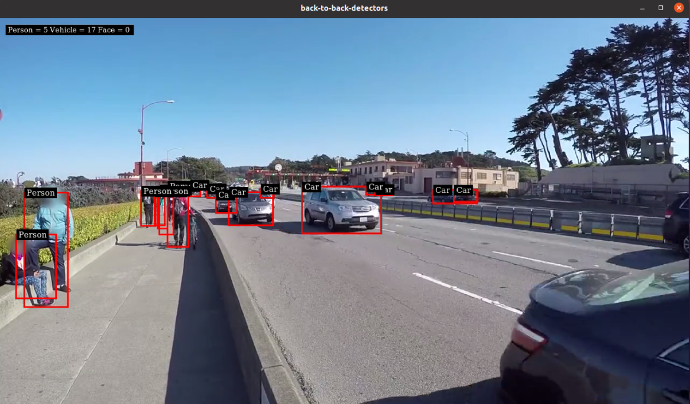

# BACK-TO-BACK-DETECTORS REFERENCE APP USING DEEPSTREAMSDK 4.0

## Introduction
The project contains Back to Back detector application to show the
capability of Deepstream SDK.

## Prequisites:

Please follow instructions in the `apps/sample_apps/deepstream-app/README` on how
to install the prequisites for Deepstream SDK, the DeepStream SDK itself and the
apps.

## Getting Started

- Export the environment variable:
  `export DS_SDK_ROOT="your deepstream SDK root"`

- Preferably clone the app in
  `$DS_SDK_ROOT/sources/apps/sample_apps/`

## Steps to download the models:
- To download the models for the second nvinfer, visit:
  https://github.com/NVIDIA-AI-IOT/redaction_with_deepstream
-  Use the following commands:
```
  $ cd $DS_SDK_ROOT/samples/models
  $ mkdir Secondary_FaceDetect
  $ cd Secondary_FaceDetect
  $ wget https://github.com/NVIDIA-AI-IOT/redaction_with_deepstream/raw/master/fd_lpd_model/fd_lpd.caffemodel
  $ wget https://raw.githubusercontent.com/NVIDIA-AI-IOT/redaction_with_deepstream/master/fd_lpd_model/fd_lpd.prototxt
  $ wget https://raw.githubusercontent.com/NVIDIA-AI-IOT/redaction_with_deepstream/master/fd_lpd_model/labels.txt
```

Back to back detectors app pipeline:


## Compilation Steps:
```
  $ make
  $ ./back-to-back-detectors <h264_elementary_stream>
```
The result should be like below:
  

NOTE:
- Edit the paths in `secondary_detector_config.txt` to the location of the models
  downloaded from the above site.

This document shall describe about the sample back-to-back-detectors application.

This sample builds on top of the deepstream-test1 sample to demonstrate how to
add multiple back-to-back detectors in the pipeline.

Two instances of the "nvinfer" element are added to the pipeline serially after
nvstreammux and before the display components. Both the "nvinfer" instances have
their own config files.

The first "nvinfer" instance (Person/Vehicle/Bicycle/RoadSign) will always act
as primary detector.

The second "nvinfer" instance (Face/License Plate) can be configured as
primary(full-frame) / secondary (operating on primary detected objects). By
default it is configured in the secondary mode. To change the second "nvinfer"
instance to primary mode, change the macro `SECOND_DETECTOR_IS_SECONDARY` in the
sources to 0.

